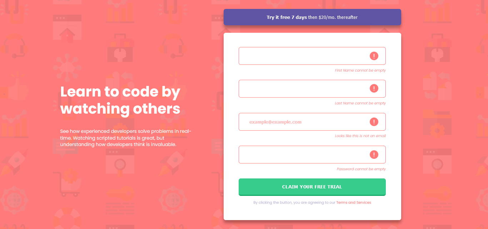

# Frontend Mentor - Intro component with sign up form solution

This is a solution to the [Intro component with sign up form challenge on Frontend Mentor](https://www.frontendmentor.io/challenges/intro-component-with-signup-form-5cf91bd49edda32581d28fd1). Frontend Mentor challenges help you improve your coding skills by building realistic projects.

## Table of contents

- [Overview](#overview)
  - [The challenge](#the-challenge)
  - [Screenshot](#screenshot)
  - [Links](#links)
- [My process](#my-process)
  - [Built with](#built-with)
  - [What I learned](#what-i-learned)
  - [Continued development](#continued-development)
  - [Useful resources](#useful-resources)
- [Author](#author)

## Overview

### The challenge

Users should be able to:

- View the optimal layout for the site depending on their device's screen size
- See hover states for all interactive elements on the page
- Receive an error message when the `form` is submitted if:
  - Any `input` field is empty. The message for this error should say _"[Field Name] cannot be empty"_
  - The email address is not formatted correctly (i.e. a correct email address should have this structure: `name@host.tld`). The message for this error should say _"Looks like this is not an email"_

### Screenshot

Below is the screenshots of the challenge, the desktop view is 1440px and the mobile view was queried at 375px.

### Links

- Solution URL: [GitHub Repository](https://github.com/Odo-Peter/frontend-mentor-sign-up)
- Live Site URL: [odo-peter.vercel.app]()

## My process

### Built with

- Semantic HTML5 markup
- CSS custom properties
- Flexbox
- Javascript

### What I learned

This challenge has taught me the importance of a proper markup and the power of CSS, alongside media queries, also, learnt about the placeholder pseudo element in CSS and further implementing it with JavaScript.

The challenge has also improved my knowledge, in terms of using markdown files and in committing a file to github, basically working with the command line has improved some more, all thanks to this and other frontend mentor's challenge worked on.

### Continued development

In future projects or challenges, I'ld love to add more javascript functions that will toggle the color scheme, to probably a dark and light mode.

### Useful resources

- [Free code camp](https://www.freecodecamp.org) - This site personally has improved my coding skills from 0 to a reasonable figure, lol, I'll recommend any person new to programming and coding to check free code camp for FREE. Ensure to be kind enough to give a little donation to help them to continue giving out value.
- [Tech Twitter](https://www.twitter.com) - Tech twitter has helped with several links to quality resources, articles, podcasts, videos, etc, that has helped to improve my coding skills and thus helping me complete this challenge.
- [W3schools](https://www.w3schools.com) - Awesome and coincise documentations.

## Author

- Frontend Mentor - [@Odo-Peter](https://www.https://frontendmentor.io/profile/Odo-Peter)
- Twitter - [@Odo_Peter_Ebere](https://www.twitter.com/iCode_X)
- Frontend Mentor - [@Odo-Peter](https://www.frontendmentor.io/profile/Odo-Peter)
